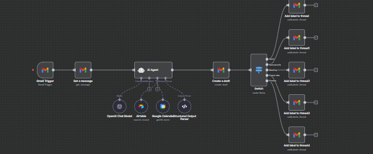

# n8n Workflows Portfolio

This repository contains a collection of n8n automation workflows I have built.  
Each workflow is exported as a JSON file and can be imported into any n8n instance to explore or run.

---

## Workflows

### 1. Email Assistant

**File:** `Email assistant.json`  
Automates email tasks such as sending, organizing, and responding to messages efficiently.  

---

### 2. Invoice Workflow

**File:** `Invoice workflow.json`  
Streamlines invoice creation, management, and tracking automatically.  

---

### 3. Lead Generation

**File:** `Lead generation.json`  
Captures and organizes leads from various sources into your CRM or spreadsheet.  

---

### 4. LinkedIn Content Creator

**File:** `LinkedIN Content Cretor.json`  
Automates LinkedIn content scheduling, posting, and engagement tracking.  

---

### 5. RAG Pipeline Chatbot

**File:** `RAG pipeline chatbot.json`  
Implements a retrieval-augmented generation (RAG) chatbot workflow for knowledge base queries.  

---

### 6. Telegram Assistant

**File:** `Telegram assistant.json`  
Automates Telegram messaging, notifications, or bot responses.  

---

### 7. Weather Report Automation

**File:** `Weather report automation.json`  
Automatically fetches weather data and sends reports to desired channels.  

---

### 7. Social Media Marketing Agent

**File:** `Social_media_automation.json`

---

## How to Use

1. Open your n8n instance (local or cloud).
2. Click **Import Workflow**.
3. Upload the JSON file you want to explore.
4. Run and test the workflow.

---
